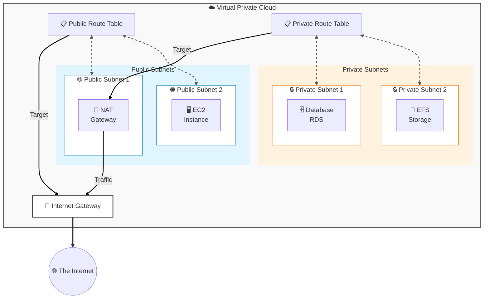

# 🌐 AWS VPC

VPC bao gồm các thành phần chính sau:

```mermaid
graph TD
    %% --- 1. EXTERNAL NETWORK ---
    Internet((🌐 The Internet))

    subgraph VPC [☁️ Virtual Private Cloud]
        style VPC fill:#f9f9f9,stroke:#333,stroke-width:2px
        
        %% --- 2. INTERNET GATEWAY ---
        IGW[🚪 Internet Gateway]
        style IGW fill:#ffffff,stroke:#333,stroke-width:2px

        %% --- 3. ROUTE TABLES ---
        PubRT[📋 Public Route Table]
        PrivRT[📋 Private Route Table]

        %% --- 4. PUBLIC SUBNETS ---
        subgraph Public_Zone [Public Subnets]
            style Public_Zone fill:#e1f5fe,stroke:none
            
            %% Public Subnet 1
            subgraph PubSub1_Box [🌐 Public Subnet 1]
                style PubSub1_Box fill:#fff,stroke:#0277bd
                NAT[🔄 NAT<br/>Gateway]
            end

            %% Public Subnet 2
            subgraph PubSub2_Box [🌐 Public Subnet 2]
                style PubSub2_Box fill:#fff,stroke:#0277bd
                EC2[🖥️ EC2<br/>Instance]
            end
        end

        %% --- 5. PRIVATE SUBNETS ---
        subgraph Private_Zone [Private Subnets]
            style Private_Zone fill:#fff3e0,stroke:none
            
            %% Private Subnet 1
            subgraph PrivSub1_Box [🔒 Private Subnet 1]
                style PrivSub1_Box fill:#fff,stroke:#ef6c00
                DB[🗄️ Database<br/>RDS]
            end
            
            %% Private Subnet 2
            subgraph PrivSub2_Box [🔒 Private Subnet 2]
                style PrivSub2_Box fill:#fff,stroke:#ef6c00
                EFS[📂 EFS<br/>Storage]
            end
        end

        %% ==========================================================
        %% ĐỊNH NGHĨA KẾT NỐI (Thứ tự rất quan trọng cho linkStyle)
        %% ==========================================================

        %% --- NHÓM 1: ASSOCIATION (Subnet liên kết với RT) -> NÉT ĐỨT ---
        %% Index 0
        PubRT <--> PubSub1_Box
        %% Index 1
        PubRT <--> PubSub2_Box
        %% Index 2
        PrivRT <--> PrivSub1_Box
        %% Index 3
        PrivRT <--> PrivSub2_Box

        %% --- NHÓM 2: ROUTE TARGET & TRAFFIC FLOW -> NÉT LIỀN ĐEN ---
        %% Index 4: Private Route đẩy traffic vào NAT
        PrivRT -- Target --> NAT
        
        %% Index 5: Public Route đẩy traffic ra IGW
        PubRT -- Target --> IGW
        
        %% Index 6: NAT Gateway đẩy traffic ra IGW (MỚI THÊM)
        NAT -- Traffic --> IGW
    end

    %% --- NHÓM 3: UPLINK (IGW ra Internet) -> NÉT ĐẬM ---
    %% Index 7: IGW uplink to Internet
    IGW ==> Internet

    %% ==========================================================
    %% STYLING
    %% ==========================================================
    
    %% 1. Biến 4 đường đầu tiên (Index 0-3) thành NÉT ĐỨT
    linkStyle 0,1,2,3 stroke-width:2px,fill:none,stroke:#555,stroke-dasharray: 5 5
    
    %% 2. Biến 3 đường tiếp theo (Index 4,5,6) thành NÉT LIỀN ĐEN
    %% Index 6: Đường kết nối từ NAT Gateway đến Internet Gateway (IGW)
    linkStyle 4,5,6 stroke-width:2px,fill:none,stroke:black

    %% 3. Đường ra Internet (Index 7) nét đậm
    linkStyle 7 stroke-width:3px,stroke:#333
```
